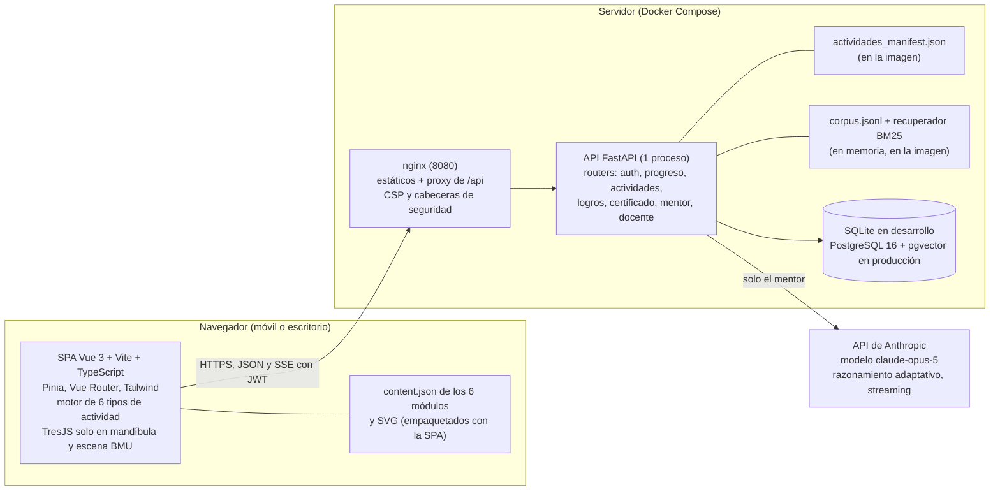
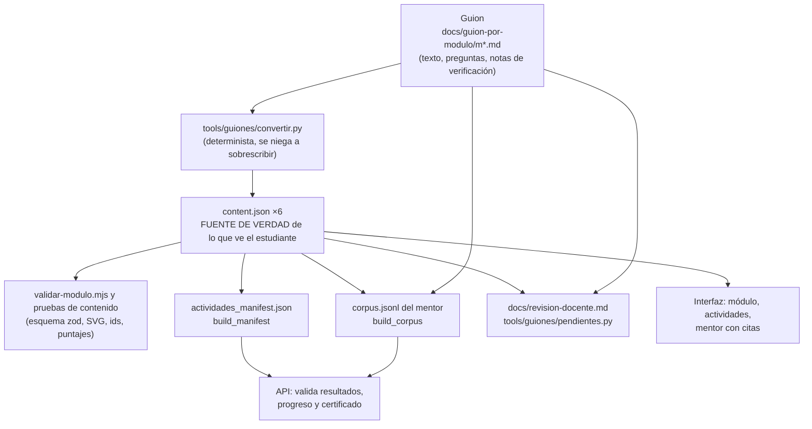
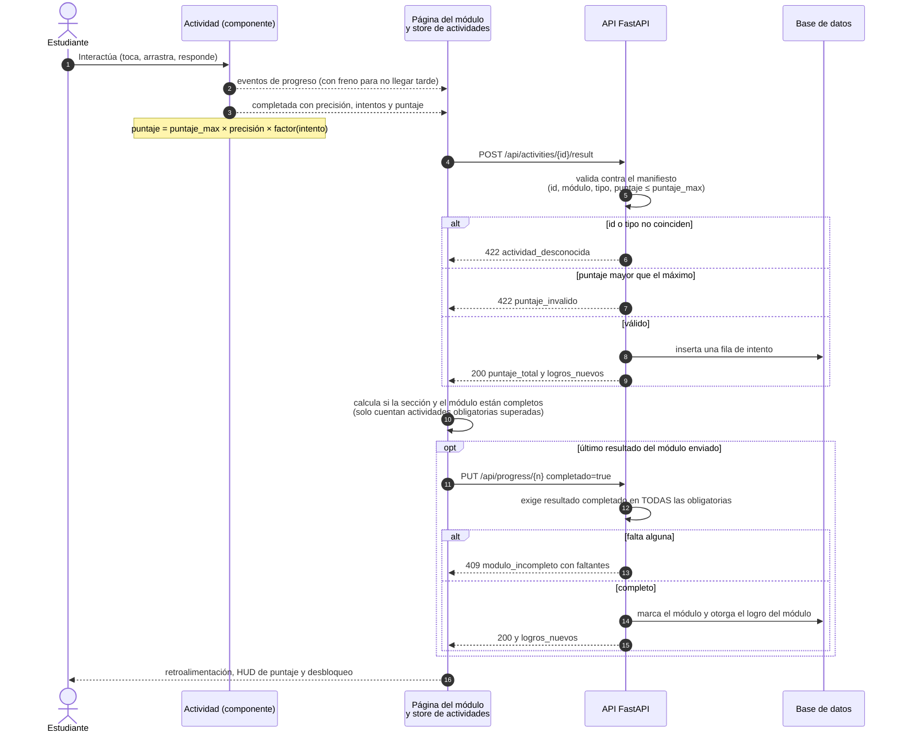
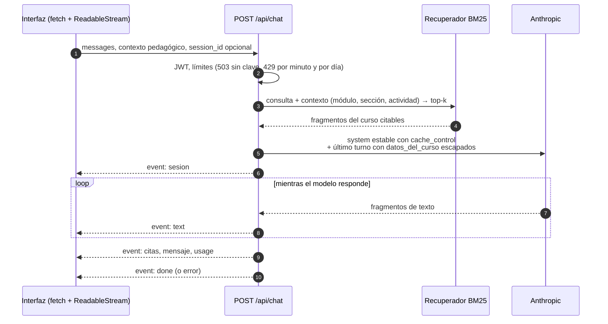

# Arquitectura

Cómo está armado el OVA, por qué se tomaron las decisiones principales y qué límites tiene hoy. Está escrito
para quien va a mantener o desplegar el sistema. Los documentos de detalle son el [contrato de la
API](api-contract.md), la [guía de contenido](content-schema.md), el [plan](../PLAN.md) y el [estado del
proyecto](../TODO.md).

- [1. Vista general](#1-vista-general)
- [2. Del guion al estudiante: la cadena del contenido](#2-del-guion-al-estudiante-la-cadena-del-contenido)
- [3. Flujo de una actividad completada](#3-flujo-de-una-actividad-completada)
- [4. El mentor: petición y eventos SSE](#4-el-mentor-petición-y-eventos-sse)
- [5. Decisiones clave y por qué](#5-decisiones-clave-y-por-qué)
- [6. Límites conocidos y deuda técnica](#6-límites-conocidos-y-deuda-técnica)
- [7. Mapa del repositorio](#7-mapa-del-repositorio)

## 1. Vista general

Es un monorepo con dos aplicaciones: una SPA (`apps/web`) y **un único backend** (`services/api`). Todo lo de
servidor vive en Python; no hay un segundo backend.



| Pieza | Tecnología | Responsabilidad |
|---|---|---|
| Interfaz | Vue 3, Vite, TypeScript, Pinia, Vue Router, Tailwind, shadcn-vue, GSAP | Navegación, actividades, gamificación visible, panel del docente, certificado. Móvil primero |
| 3D | `@tresjs/core` y `@tresjs/cientos` sobre three.js | **Solo** la mandíbula (STL provisional de BodyParts3D) y una escena procedural del remodelado; el resto es SVG/2D |
| Contenido | `content.json` por módulo + SVG en `public/images/` | El texto, las preguntas y los puntajes son datos, no código. Los componentes de actividad son genéricos |
| API | FastAPI, SQLModel, Alembic, PyJWT, reportlab | Usuarios, progreso, resultados, logros, certificado, panel docente y mentor |
| Base de datos | SQLite (dev) / PostgreSQL 16 (prod), nueve tablas de datos | Usuarios, progreso por módulo, resultados por actividad, logros, certificados, conversaciones y consumo del mentor |
| Mentor | SDK `anthropic`, prompt versionado (`mentor_v1.md`), BM25 propio | Responde con el material del curso; guarda conversaciones y consumo |
| Recuperación | Corpus de <!--c:fragmentos_corpus-->598<!--/c--> fragmentos en `corpus.jsonl` | Búsqueda léxica en español (sin tildes, con raíz de palabra) filtrada por módulo |
| Empaquetado | Dockerfile de la API, Dockerfile + nginx de la web, `docker-compose.yml` | Un solo puerto público (8080) |

El navegador siempre habla con **un solo origen**: en desarrollo, Vite reenvía `/api` a FastAPI (puerto 8000); en
Docker, nginx hace lo mismo hacia el servicio `api`. Por eso CORS casi no interviene.

### Modelo de datos

`users` (nombre, apellido, tipo y número de identificación, nivel, rol; único sobre el par tipo+número),
`progress_modulos` (una fila por usuario y módulo), `activity_results` (una fila por intento: historial),
`achievements` y `user_achievements`, `certificates` (una por usuario, con una instantánea de la identidad),
`chat_sessions` y `chat_messages` (con tokens, modelo, citas y valoración) y `usage_events` (consumo del mentor por
petición), más la tabla `alembic_version` de las migraciones. Las migraciones están en `services/api/alembic/versions/` (tres, aplicadas también
contra PostgreSQL 18).

## 2. Del guion al estudiante: la cadena del contenido

El contenido nació como **guion** en Markdown, se convirtió con una herramienta determinista y después se
terminó a mano. De ahí salen otros tres artefactos que la API y el docente necesitan.



- **Un módulo es un archivo.** El esquema (zod, en `apps/web/src/content/schema.ts`) valida estructura, referencias
  cruzadas, límites de longitud, ids y reglas de los SVG. Ver [content-schema.md](content-schema.md).
- **`content.json` manda.** Desde que se pulieron a mano, el convertidor no los sobrescribe (salvo `--forzar`).
  Las pruebas de cada módulo comparan el JSON con su guion en lo estructural.
- **Derivados versionados.** El manifiesto y el corpus viajan en la imagen de la API, porque esta no ve `apps/web`.
  La integración continua falla si alguno está desactualizado (`--comprobar`).

## 3. Flujo de una actividad completada

El motor de actividades tiene seis componentes (`multicapa`, `arrastre-molecular`, `relacion-columnas`, `quiz`,
`video-texto` y `exploracion-3d`) que cumplen un contrato común (`apps/web/src/activities/types.ts`) y una batería de
pruebas de conformidad. Ninguno calcula el puntaje por su cuenta: usan `calcularPuntaje` de `content/scoring.ts`.



Detalles que importan:

- **Puntaje del servidor:** `puntaje_total` es la suma, por actividad, del **mejor** puntaje entre los intentos
  completados. Repetir no acumula.
- **Sin conexión o error:** los resultados pendientes quedan en una cola persistida en el navegador y se reintentan.
  Un 422 no bloquea al estudiante.
- **Carrera:** el `PUT` del módulo se envía **después** de que termine el último `POST`; si el navegador se cerró entre
  ambos, se reenvía al cargar.
- **Certificado:** con los seis módulos completados y el 70 % del puntaje de las obligatorias, `POST /api/certificate`
  emite (idempotente) un código `OVA-XXXX-XXXX`; el PDF se genera con reportlab y la verificación pública es
  `GET /api/verify/{codigo}`.
- **Tiempo:** con la pestaña visible, la interfaz suma `tiempo_delta_seg` cada 30 s al módulo.

## 4. El mentor: petición y eventos SSE



El contexto pedagógico (`ContextoPedagogico`, congelado) y los fragmentos recuperados viajan como **datos** dentro de
`<datos_del_curso>` en el último mensaje del estudiante, con `<`, `>` y `&` escapados y la orden de no obedecerlos. El
bloque estable del prompt lleva `cache_control` para aprovechar el caché de prompts de Anthropic.

**Contrato de eventos SSE.** Cada evento es `event: <nombre>` y `data: <objeto JSON>`; cada 15 s sale un comentario
`: ping`. El cliente **ignora los eventos que no conoce**. Orden de una respuesta completa: `sesion`, `text`\*, `citas`,
`mensaje`, `usage`, `done`. En un fallo: `sesion`, `text`\*, [`usage`], `error` (sin `citas` ni `mensaje`, y la respuesta
no se guarda). El stream termina con exactamente un `done` o un `error`.

| Evento | Payload | Nota |
|---|---|---|
| `sesion` | `{"session_id": 12}` | Primero. La conversación en la que se guardó el mensaje |
| `text` | `{"delta": "..."}` | Fragmento de la respuesta |
| `citas` | `{"citas": [{"id", "modulo", "seccion_id", "titulo", "url"}]}` | Solo si terminó bien y se recuperó material; en el orden de las etiquetas `[1]`, `[2]`... |
| `mensaje` | `{"message_id": 31}` | Id de la respuesta guardada (para el feedback) |
| `usage` | `{"input_tokens", "output_tokens", "cache_read_input_tokens", "cache_creation_input_tokens"}` | Una vez, al final; también se registra en `usage_events` |
| `done` | `{"stop_reason": "end_turn"}` | Terminal de éxito |
| `error` | `{"code": "refusal" \| "max_tokens" \| "upstream_error" \| "rate_limited", "message": "..."}` | Terminal de fallo |
| `tool_use` | `{"id", "name", "input"}` | Reservado para las herramientas de cámara 3D; **no se emite** |

Respuestas de error **antes** del stream: `503 ia_no_configurada` (sin clave), `429 limite_diario`,
`429 demasiados_intentos`, `404 sesion_no_encontrada` y `401`. Cuando el cliente se desconecta, la petición a Anthropic se
cancela y se registra el consumo. Detalle completo en [api-contract.md](api-contract.md).

## 5. Decisiones clave y por qué

| Decisión | Alternativa descartada | Por qué |
|---|---|---|
| **Vue 3 + TresJS** | React + React Three Fiber | Preferencia del equipo; TresJS cubre GLTF, Draco y eventos por malla |
| **Un solo backend en FastAPI** | Laravel + Sanctum + MySQL | Laravel es pesado para el alcance, todo el equipo trabaja en Python y se evita validar tokens entre dos servidores |
| **SQLModel + Alembic; SQLite en dev, PostgreSQL en prod** | MySQL | Desarrollo sin instalar nada; PostgreSQL con pgvector deja abierta la búsqueda vectorial en la misma base |
| **Python 3.14 con `uv`** | Python 3.12 | Es el instalado en la máquina del equipo; `uv` usa el intérprete del sistema |
| **PyJWT** | `python-jose` | `python-jose` no tiene mantenimiento activo |
| **Registro sin contraseña** (tipo y número de documento) | Correo y contraseña, o código por correo | Pedido del equipo para arrancar; el riesgo de suplantación se aceptó para el piloto y se decide antes de abrirlo (tarea F6-08) |
| **Unicidad sobre el par tipo+número** | Solo el número | Un mismo número puede repetirse entre tipos (cédula y pasaporte) |
| **Chat por SSE propio con `fetch`** | `@ai-sdk/vue` (protocolo del AI SDK) | Emular ese protocolo en FastAPI es frágil y las herramientas de cámara 3D necesitan control de eventos. `EventSource` tampoco sirve: no permite POST ni cabeceras |
| **BM25 propio en Python puro** | Embeddings + ChromaDB (y pgvector) | Nada pesado que no corra en Windows con Python 3.14 ni en una imagen `slim`. Con ~600 fragmentos en español y terminología exacta, el fragmento correcto está entre los 3 primeros el 94 % de las veces ([mentor-eval.md](mentor-eval.md)). No entiende sinónimos; pgvector queda como otra clase con la misma interfaz `Retriever` |
| **El mentor guía, no resuelve** (las actividades calificadas no entran al corpus) | Corpus completo | Si sus enunciados y respuestas estuvieran en el corpus, el mentor podría filtrarlas |
| **Bloque estable del prompt con `cache_control`; datos al final** | Todo en el `system` | Mantiene el prefijo cacheable y aísla los datos no confiables |
| **Certificado con reportlab + fuentes DejaVu** | WeasyPrint | WeasyPrint necesita GTK/Pango en Windows y complica la imagen; reportlab es Python puro, trae QR y da control total |
| **Manifiesto de actividades generado del contenido** | La API lee `apps/web` | La imagen de la API no ve `apps/web`; el manifiesto se versiona y viaja con ella. Sin manifiesto, la API se comporta como en la Fase 1 |
| **Certificado al 70 % de las obligatorias** | Solo completar los módulos | Que una opcional no compense una obligatoria fallada. **Umbral por confirmar con el docente** |
| **`aprobacion_min` sobre la precisión, no sobre el puntaje** | Umbral sobre el puntaje | Con la penalización por intento, el 70 % del puntaje es inalcanzable desde el 5.º intento y quien falló cuatro veces quedaría bloqueado para siempre |
| **Bloqueo por secuencia en el frontend** (`true` por defecto) | Bloqueo en el servidor | Requisito del briefing (actuar para avanzar); el servidor solo valida que los módulos completos tengan sus obligatorias |
| **Un docente ve todo sin guardar nada** | El docente usa el bloqueo | Revisar los seis módulos sin ensuciar las estadísticas |
| **Motor genérico + `content.json`** | Un componente por módulo | Seis módulos comparten seis tipos de interacción; el docente puede corregir sin tocar código |
| **3D solo en mandíbula (y una escena del remodelado)** | 3D en todo | Requisito de móvil al 100 %; el resto es SVG, que funciona con toque y pesa poco |
| **Escena BMU procedural** | GLB de células | No hay GLB de células; el estado es una función pura del tiempo, probada, con alternativa sin WebGL |
| **Docker: nginx con mismo origen y solo el puerto 8080** | Publicar la API y la base | No chocar con el PostgreSQL local (5432) y reducir la superficie expuesta |
| **Un solo proceso de la API** | Varios workers | El límite de intentos vive en memoria; con más procesos cada uno llevaría su cuenta |
| **Identificación enmascarada en el panel y el certificado** | Mostrarla completa | Es un dato personal: solo se ve completa buscando ese número exacto o con confirmación al exportar |

## 6. Límites conocidos y deuda técnica

Lo que **no** funciona, no se ha verificado o se aceptó como riesgo. Es la lista honesta; el resumen para el docente
está en [entrega.md](entrega.md).

**Verificación que nadie ha hecho**

- **El mentor con una clave real de Anthropic.** Todo se probó con un servidor simulado. No se sabe cómo responde el
  modelo a las reglas del prompt (no resolver actividades, citar `[n]`, admitir lo que el material no cubre), ni si el
  caché de prompts se activa (`cache_read_input_tokens` mayor que 0 en la segunda consulta), ni si la beta de
  `MENTOR_SERVER_FALLBACK` está habilitada en la cuenta.
- **Un teléfono real.** La revisión visual que se hizo (mandíbula, escena del remodelado) fue en Chrome de escritorio con emulación
  táctil, no en un teléfono: no se probó el pellizco de dos dedos, el rendimiento del 3D en gama media, el teclado virtual sobre el chat ni las
  zonas de toque de 44 px.
- **Docker.** Nunca se han construido las imágenes ni levantado el conjunto. La integración continua tampoco se ha
  ejecutado en GitHub.
- **La mayoría de las pantallas** (menú circular, HUD, módulo, actividades, panel docente, certificado) están probadas
  por unidades con la API simulada; varias no tienen verificación visual completa en claro y oscuro (ver las filas `[~]`
  del `TODO.md`).

**Contenido**

- **Todo el contenido pedagógico es un borrador nuestro sin validar** (estado `borrador` en los seis módulos), con
  cientos de cifras pendientes ([revision-docente.md](revision-docente.md)). Las <!--c:referencias-->125<!--/c--> referencias
  bibliográficas no están verificadas.
- **No hay videos reales** (<!--c:videos_reales-->0<!--/c-->): las explicaciones son animaciones SVG.
- **El modelo 3D es provisional**: STL de BodyParts3D sin editar, con puntos de interés (`ancla`) colocados por
  aproximación sobre una sola malla. No hay GLB con nodos ni modelos de células (F0-08 a F0-10 sin hacer).
- **Los <!--c:bloques_posgrado-->17<!--/c--> bloques de nivel posgrado son inalcanzables**: la interfaz no tiene ninguna pantalla para cambiar
  el nivel del usuario (solo `PATCH /api/me`).

**Diseño y seguridad**

- **El puntaje lo reporta el cliente.** El servidor comprueba que la actividad exista, que el tipo coincida y que el
  puntaje no supere el máximo, pero no puede verificar la precisión; además, **las respuestas correctas y las
  explicaciones viajan en el paquete de la interfaz**. El puntaje mide participación y estudio, no es una evaluación
  segura.
- **`aprobacion_min` no está en el manifiesto** y la precisión viaja solo dentro de `detalle`: el servidor es más laxo
  que la interfaz (nunca bloquea a quien cumple). Los cambios pendientes están en la sección 14 de
  [content-schema.md](content-schema.md).
- **`POST /api/activities/{id}/result` no tiene límite de frecuencia** ni tope de filas por actividad.
- **Acceso sin contraseña** (F6-08): quien sepa el documento de otra persona puede entrar como ella.
- **Limitador en memoria de un proceso**: no sobrevive a reinicios y obliga a un solo proceso. Detrás de un proxy TLS
  hay que ajustar `real_ip` en nginx para que el límite por IP no cuente a todos como uno.
- **Los logros transversales no existen** (solo los seis por módulo). Tampoco el ranking.
- **El día del tope de mensajes es fijo** en el calendario de Colombia (UTC-5).

**Mentor y búsqueda**

- **No están hechas** las herramientas del mentor sobre la escena (`enfocar_estructura`, `ir_a_seccion`,
  `abrir_actividad`), el «Explícame esto» (`/explain`), la sugerencia de refuerzo al entrar a un módulo
  (`/progress-hint`) ni las preguntas generadas por IA (`/quiz`). El evento `tool_use` está reservado.
- **Faltan los pulgares arriba y abajo** en la interfaz (el backend ya guarda la valoración) y recuperar el historial
  al recargar la página.
- **BM25 no entiende sinónimos** ni el vocabulario que el material no usa («sacar un diente» frente a «extracción»);
  el mejor fragmento entra primero solo entre el 54 y el 75 % de las veces. Las medidas se hicieron con preguntas
  escritas por nosotros, no por estudiantes.
- **`RAG_BACKEND=pgvector` no está implementado**: la API se niega a arrancar con él. La extensión se crea en el
  contenedor de PostgreSQL pero no se usa.

**Mantenimiento**

- **El manifiesto y el corpus se regeneran a mano** al cambiar el contenido; la integración continua avisa si se
  olvidan.
- **Las pruebas de cada módulo fijan el estado `borrador`** y comparan el JSON con su guion en lo estructural: al
  aprobar un módulo o editar una explicación hay que actualizar la prueba o el guion.
- **Sin procedimiento de reversión** de una actualización más allá de restaurar la copia de seguridad.

## 7. Mapa del repositorio

```text
apps/web/                     Interfaz (Vue 3 + Vite + TypeScript)
  src/modules/m1_…m6_…/       content.json de cada módulo y sus pruebas de contenido
  src/activities/             Los seis tipos de actividad y su contrato común
  src/content/                Esquema zod, puntaje, auditorías y consultas del contenido
  src/scenes/                 Mandíbula 3D y escena procedural del remodelado
  src/ai/                     Cliente del mentor: SSE, sanitizado y markdown
  src/components/, views/     Menú circular, HUD, módulo, panel docente, certificado, logros
  src/stores/, router/        Pinia (sesión, progreso, actividades, contexto) y rutas con guardas
  public/images/m1…m6/        Dibujos SVG de cada módulo; public/models/ el modelo 3D
  scripts/validar-modulo.mjs  Validador de un módulo
  nginx.conf, Dockerfile      Empaquetado de la interfaz
services/api/                 API FastAPI
  app/routers/, schemas/      Endpoints y contratos
  app/models/, services/      Tablas, reglas (logros, certificado, manifiesto, panel)
  app/ai/, app/rag/           Mentor: cliente, prompt, SSE; corpus y recuperador BM25
  app/data/                   Manifiesto y corpus (versionados)
  app/scripts/                build_manifest, build_corpus, promote_docente
  alembic/versions/           Migraciones
tools/guiones/                Convertidor de guiones y generador de la lista de revisión
docs/                         Contrato, esquema, guías, lista de revisión, revisiones y atribuciones
docker-compose.yml, docker/   Despliegue de producción
```
